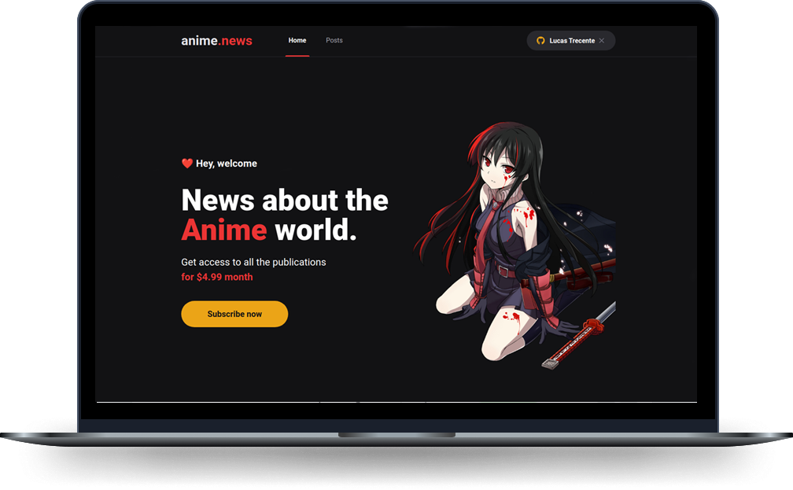

<p align="center">
  
  
  
</p>

<h1 align="center">
    
</h1>

<br>

## 🖥️ Technologies

This project was developed using the following technologies:

- [ReactJS](https://reactjs.org/)
- [NextJS](https://nextjs.org/)
- [TypeScript](https://www.typescriptlang.org/)
- [SASS](https://sass-lang.com/)
- [Next-Auth](https://next-auth.js.org/)
- [Stripe](https://stripe.com/)
- [FaunaDB](https://fauna.com/)
- [Prismic CMS](https://prismic.io/)

## 🚀 Getting started

Clone the project and access the folder.

```bash
$ git clone https://github.com/lucastrecente/anime.news.git
$ cd anime.news
```

Follow the steps below:

```bash
# Install the dependencies
$ yarn

# Start the project
$ yarn dev
```

The app will be available for access on your browser at http://localhost:3000

## 🏆 Team

It is maintained by the following person(s)

| [](https://github.com/lucastrecente) |
| ---------------------------------------------------------------------------------------------------- |
| [Lucas Trecente](https://github.com/lucastrecente)                                                   |                                                |

## 📝 License

This project is licensed under the MIT License. See the [LICENSE](LICENSE) file for details.

---


